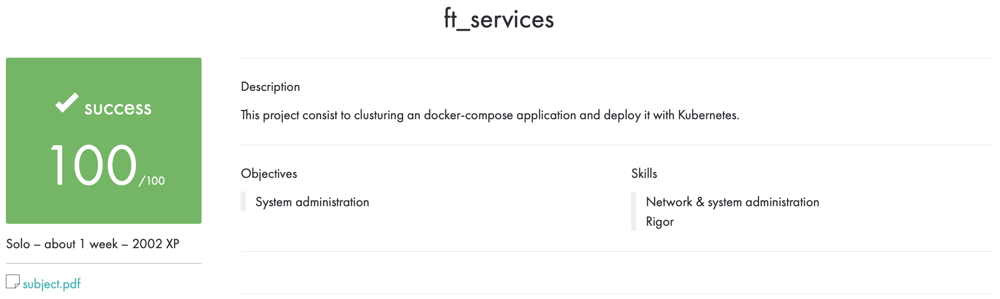

# ft_services

## Описание

Этот проект состоит в кластеризации приложения docker-compose и развертывании его с помощью Kubernetes.

## Использование

Перед запуском нужно установить ``VirtualBox`` и ``Minikube``.

Напишите в терминале ``sh setup.sh``, после чего проект соберется.

## Оценка

